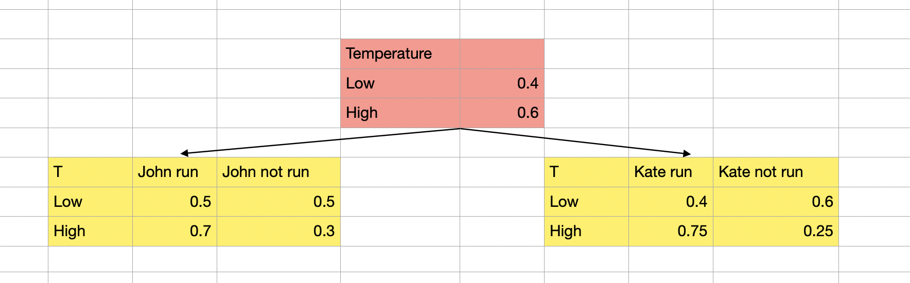
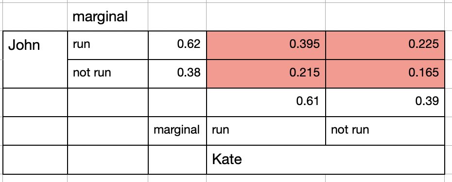

# Bayesian Serious - Part II absolute and conditional independence

## Absolute independence and conditional independence                  
Absolute independence: P(A=a | B=b) = P(A=a) , A ⟂ B                      
Conditional independence: P(A=a | B=b, C=c) = P(A=a | C=c) , A ⟂ B | C              
Question:                                       
	1) A ⟂ B => A ⟂ B | C, right or wrong               
	2) A ⟂ B | C => A ⟂ B, right or wrong             

 
说约翰和凯特两个人去跑步，                              
晴天的时候，约翰跑步的概率为0.6， 凯特跑步的概率为0.7           
雨天的时候，约翰跑步的概率为0.2， 凯特跑步的概率为0.3                                                
你这么乍一看，约翰和凯特跑步好像相关啊，你大我大，你小我小， 这时候我们就需要绝对无关和相对无关的概念了      
  
说约翰和凯特两个人情同手足，跑步都是约一起，那俩人跑步肯定相关啊                          
说约翰和凯特两个人压根儿不认识， 只是下雨天了，但是天气是不可抗力，大家只能在晴天跑步啊。               

P(约翰跑步 ｜ 凯特跑步，晴天) = P(约翰跑步 ｜ 晴天) ？           
在晴天的时候，约翰跑步是不是和凯特跑步无关？            

那晴天无关了，雨天就一定无关么，不一定                        

说凯特和约翰两个人，都有点儿神经病，他们喜欢一起淋雨跑步                    
当晴天的时候，两个人各跑各的，谁也不叫着谁，雨天的时候，约翰总是喜欢叫着凯特一起跑步，凯特也喜欢在雨天约约翰一起跑。    
雨天的时候，如果没有对方的陪伴，这俩人是不会独自去跑步的。     

P(约翰跑步 ｜ 凯特跑步，雨天) = P(约翰跑步 ｜ 雨天) ？        
这左边就变成了： 100%，因为这个雨天了，如果凯特跑步，约翰就一定跑           
这右边就变成了： 雨天中（俩人）跑步的概率                                   
这俩明显不想等啊，这时候，在雨天的条件下，凯特跑步和约翰跑步就是相关的。             

回到上面英文的问题来说，         
如果约翰和凯特两人跑步时绝对无关的，那么他们是不是一定是在某种条件下相对无关的。          
如果约翰和凯特两人跑步时相对无关的，那么他们是不是一定是绝对无关的。          
      
这个问题就复杂一些。		[其实我应该把这个问题换成温度高和温度低来说的]               

## Conditional independence -> Absolute independence ????             
We are going to answer the 1st question.               

**下面两个表啊，您看看，每一行想加都等于1，说明啥 - 黄色的表里面，都是conditional probability啊**           
**在温度高的情况下， John跑步的概率是多少，不跑步的概率是多少， Kate跑步的概率是多少，不跑步的概率是多少**           
P(John run|Low), P(~ John run|Low)…..这些玩意儿，如果当成了joint probability，就宛如智障了。           

Assume John going for a run and Kate going for a run is conditionally independent. That is:     
**P(John=yes | Kate=yes, Temp=low) = P(John=yes | Temp=low)**         
**P(John=yes | Kate=yes, Temp=high) = P(John=yes | Temp=high)**         

P(John=yes , Kate=yes)                          
	= P(John=yes , Kate=yes, Temp = low) + P(John=yes, Kate=yes, Temp=high)                
	= P(Temp=low) * P(Kate=yes | Temp=low) * P (John=yes |Temp=low, Kate=yes)             
	 +P(Temp=high) * P(Kate=yes | Temp=high) * P (John=yes |Temp=high, Kate=yes)             

The formula above is actually marginal probability.                 
_P(High) = P(High & Sunny) +  P(High & Cloudy) + P(High & Rainy)_              
Marginal probability of one event of a variable =               
Join probability of that event over all possible events of the other variable.          

Due to our assumption:, 我们就把 Kate干掉了， Kate干掉以后，世界就清爽了一些了                

P(John=yes , Kate=yes)              
	= P(Temp=low) * P(Kate=yes | Temp=low) * P (John=yes |Temp=low)           
	 +P(Temp=high) * P(Kate=yes | Temp=high) * P (John=yes |Temp=high)         
   = 0.4 * 0.4 * 0.5 + 0.6 * 0.75 * 0.7 =  39.5%             

P(John=no , Kate=no) 
	= P(John=no , Kate=no, Temp = low) + P(John=no, Kate=no, Temp=high)
	= P(Temp=low) * P(Kate=no | Temp=no) * P (John=no |Temp=low, Kate=no)
	 +P(Temp=high) * P(Kate=no | Temp=high) * P (John=no |Temp=high, Kate=no)

	= P(Temp=low) * P(Kate=no | Temp=low) * P (John=no |Temp=low)
	 +P(Temp=high) * P(Kate=no | Temp=high) * P (John=no |Temp=high)
  = 0.4 * 0.6 * 0.5 + 0.6 * 0.25 * 0.3 =  22.5%

P(John=yes , Kate=no) 
	= P(Temp=low) * P(Kate=no | Temp=low) * P (John=yes |Temp=low)
	 +P(Temp=high) * P(Kate=no | Temp=high) * P (John=yes |Temp=high)
  = 0.4 * 0.6 * 0.5 + 0.6 * 0.25 * 0.7 = 10.5%

P(John=no , Kate=yes) 
	= P(Temp=low) * P(Kate=yes | Temp=low) * P (John=no |Temp=low)
	 +P(Temp=high) * P(Kate=yes | Temp=high) * P (John=no |Temp=high)
  = 0.4 * 0.4 * 0.5 + 0.6 * 0.75 * 0.3 = 21.5%

To solve this problem, we need to fill the contingency table [**With Join prob**]

你看，这个行总和，列总和，marginal相加 = 1，都是对的，带劲得很。

### Answer the question
P(John=yes | Kate=yes) = P(John=yes, Kate=yes) / P(Kate=yes) = 0.395 / 0.61 = 64.75%
P(John=yes) = 62%
P(John=yes | Kate=yes) != P(John=yes)
这个故事告诉我们啊，这俩人跑步不跑步时相对独立的，俩人都不一起跑步。
但是受到天气的影响，两人的动作有一定的同步性，也不是完全无关的。
天气好的时候，很多人都有类似的规律的。
但是在某个固定天气的情况下，俩人跑步还是可以没有任何的毛关系的。

#statistics